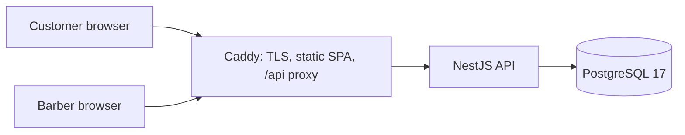
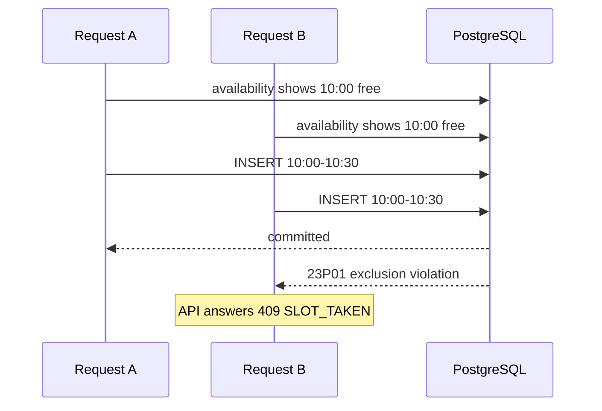

# Architecture and the decisions behind it

## Shape of the system



Three containers. Caddy is the only one with published ports; the API is reachable
only from Caddy, and PostgreSQL only from the API, enforced by two Docker networks
where the database network is marked internal.

## Preventing double booking

Two customers can load the booking page at the same moment, both see 10:00 free,
and both submit. Checking availability and then inserting cannot fix this: the
check and the insert are separate operations, and between them the other request
can commit.

The database resolves it instead:

```sql
ALTER TABLE "Booking"
  ADD CONSTRAINT "booking_no_overlap"
  EXCLUDE USING gist ((tstzrange("startTime", "endTime", '[)')) WITH &&)
  WHERE ("status" IN ('PENDING', 'CONFIRMED', 'COMPLETED'));
```

- `tstzrange(..., '[)')` makes the range half open, so an appointment ending at
  10:30 does not conflict with one starting at 10:30.
- `WITH &&` rejects any row whose range overlaps an existing one.
- The `WHERE` clause keeps cancelled and no-show rows out of the index, so
  cancelling frees the slot immediately with no extra bookkeeping.

PostgreSQL evaluates this while holding the relevant index locks, so of two
concurrent transactions inserting the same interval, exactly one commits and the
other fails with SQLSTATE 23P01. The API maps that to `409 SLOT_TAKEN`.

Prisma cannot express exclusion constraints, so it lives in a hand-written
migration alongside the generated one, and
[booking-status.spec.ts](../apps/api/src/bookings/booking-status.spec.ts) parses
the migration and fails if the application's list of slot-occupying statuses ever
drifts from the constraint's `WHERE` clause.

There is deliberately no transaction wrapped around the availability check and
the insert. A transaction would not help: the read takes no locks, so it would
not prevent the race. The constraint is the guarantee; the earlier check exists
only to produce a friendly message for the common case.



## Time and daylight saving

Every instant is stored as `timestamptz` in UTC. Recurring configuration, such as
"we open at 09:00", is stored as a minute offset from local midnight instead,
because storing it as an instant would silently shift the opening time twice a
year.

Conversion happens in one place,
[TimeService](../apps/api/src/common/time/time.service.ts), using Luxon and the
`BUSINESS_TIMEZONE` environment variable. Wall-clock times are resolved by setting
fields on a zoned date rather than by adding minutes to midnight; on the day the
clocks change those two are an hour apart. Appointment length is elapsed time, so
a 30 minute haircut stays 30 real minutes even across a transition.

The timezone is deployment configuration rather than an editable setting, because
changing it would reinterpret every appointment already in the database.

## Availability

The engine is split so the rules can be tested without a database.
[slot-calculator.ts](../apps/api/src/availability/slot-calculator.ts) is pure: it
receives working hours, breaks, busy intervals, the service duration, the slot
interval, the earliest and latest acceptable start, and a function that resolves
minute offsets to instants. It has no clock, no timezone library and no
repository.

[AvailabilityService](../apps/api/src/availability/availability.service.ts) loads
the context in a fixed number of queries regardless of how many days are
requested, then computes each day from it.

Booking creation calls the same code path, so a request can only claim a time the
system actually advertised. Off-grid start times, times inside a break, times
outside opening hours and times inside the minimum notice period are all rejected
by the same logic that produced the list in the first place.

Manual entry by the barber intentionally skips opening hours and notice period: a
walk-in at closing time is legitimate. Overlap protection still applies, because
two customers in one chair is not.

## Authentication

Server-side sessions rather than JWTs, because a session must be revocable
immediately: changing the password logs every device out, and there is exactly one
instance so there is nothing to synchronise.

- Argon2id with 19 MiB of memory, 2 iterations, 1 lane, the OWASP recommendation.
- The cookie carries 256 bits of randomness. Only its SHA-256 hash is stored, so a
  leaked dump contains no usable credential. No salt or stretching is needed for a
  value with that much entropy.
- HttpOnly, signed, `SameSite=Lax`, `Secure` in production.
- Sliding expiry: an active session is extended, and `lastSeenAt` is only written
  every five minutes to avoid a database write per request.
- Login answers identically for an unknown address and a wrong password, and pays
  the cost of a hash verification either way, so the response reveals nothing
  about which addresses exist.

## CSRF

Two independent checks on every state-changing request: the `Origin` header must
be an allowed origin, and a readable cookie must match a token echoed in the
`X-CSRF-Token` header. A cross-site attacker can cause the cookie to be sent but
cannot read it to build the header. Requests with no `Origin` at all are not
subject to the origin check, since CSRF requires a browser.

## What is deliberately absent

No Redis: rate limiting is in memory, which is correct for a single instance and
one less thing to run on a 4 GB VM. No queue or search engine: there is nothing
asynchronous and nothing to index. No Kubernetes: one machine, one Compose file.
No cloud services, so the whole system can be moved by copying a directory and a
database dump.

## Growing the system

| Change             | What it would touch                                                                                                                                                             |
| ------------------ | ------------------------------------------------------------------------------------------------------------------------------------------------------------------------------- |
| Multiple barbers   | A `Barber` table, a `barberId` on `Booking`, `WorkingHours` and `BlockedTime`, and the exclusion constraint extended with `barberId WITH =` (needs the `btree_gist` extension). |
| Customer accounts  | A `Customer` table and an optional link from `Booking`. The `Role` column already allows a non-admin role.                                                                      |
| Reminders          | An outbox table plus a scheduled worker. `customerEmail` and `customerPhone` are already captured.                                                                              |
| Payments           | A `Payment` table keyed by booking. Money is already `numeric(10,2)`, never floating point.                                                                                     |
| Multiple locations | A `Location` table, and working hours and blocked times scoped to it.                                                                                                           |
| Reporting          | Read-only queries over the existing tables; `COMPLETED` and `NO_SHOW` are already distinct states.                                                                              |

The single-row `BookingSettings` table is the one thing that would need
rethinking, since policy becomes per barber or per location.
