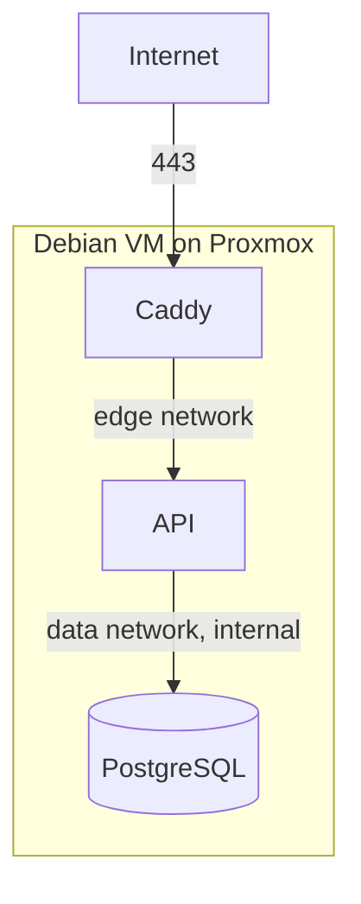

# Deployment

## The short version

On any host with Docker:

```bash
curl -fsSLO https://raw.githubusercontent.com/DenislavMladenov/HairDresser_booking_platform/main/compose.yml
docker compose up -d

docker compose exec api booking seed
docker compose exec -e ADMIN_EMAIL='you@example.com' -e ADMIN_PASSWORD='...' \
  api booking bootstrap-admin
```

No registry login and no repository checkout: the images are public and
`compose.yml` is the only file the host needs.

That is the whole deployment. The app answers on port 80 at whatever address the
host has, whether that is `localhost`, `192.168.1.50` or a hostname. There is no
`.env` to write, no domain to declare and no origin to whitelist:

- the database password and the session secret are generated on first start and
  kept in a volume,
- migrations are applied by the API as it starts,
- the expected browser origin is derived from each request, so the same image
  works on every host,
- cookies are marked Secure only when the request actually arrived over HTTPS,
  because a browser would otherwise refuse to send them back.

Everything below is for the cases that need more: a public domain with HTTPS, a
VM built from scratch, backups, or publishing your own images.



## Going public with a domain

Two values, and only when you want a certificate:

```ini
DOMAIN=booking.example.com
ACME_EMAIL=you@example.com
```

Caddy then obtains and renews a certificate automatically, which requires public
DNS pointing at the machine and ports 80 and 443 reachable. Cookies become Secure
on their own, because the requests now arrive over HTTPS.

Full VM setup follows.

## 1. Create the VM

In Proxmox, 2 vCPU, 4 GB RAM and 50 GB disk is enough. Debian and the RHEL family
both work; the only differences are the package manager and the firewall, covered
below. Give the machine a static address or a DHCP reservation, since either DNS
or the people using it will point at that address.

Then, on the VM:

```bash
# Debian or Ubuntu
sudo apt update && sudo apt upgrade -y && sudo apt install -y ca-certificates curl

# Rocky, Alma or RHEL
sudo dnf -y upgrade && sudo dnf -y install ca-certificates curl
```

Enable the QEMU guest agent in the VM options if you want clean Proxmox
shutdowns and snapshots.

## 2. Install Docker

On Debian or Ubuntu:

```bash
sudo install -m 0755 -d /etc/apt/keyrings
sudo curl -fsSL https://download.docker.com/linux/debian/gpg -o /etc/apt/keyrings/docker.asc
sudo chmod a+r /etc/apt/keyrings/docker.asc
echo "deb [arch=$(dpkg --print-architecture) signed-by=/etc/apt/keyrings/docker.asc] https://download.docker.com/linux/debian $(. /etc/os-release && echo "$VERSION_CODENAME") stable" \
  | sudo tee /etc/apt/sources.list.d/docker.list > /dev/null
sudo apt update
sudo apt install -y docker-ce docker-ce-cli containerd.io docker-buildx-plugin docker-compose-plugin
sudo systemctl enable --now docker
sudo usermod -aG docker "$USER"
```

On Rocky, Alma or RHEL:

```bash
sudo dnf -y install dnf-plugins-core
sudo dnf config-manager --add-repo https://download.docker.com/linux/centos/docker-ce.repo
sudo dnf -y install docker-ce docker-ce-cli containerd.io docker-compose-plugin
sudo systemctl enable --now docker
sudo usermod -aG docker "$USER"
```

If `config-manager --add-repo` is rejected, the host has dnf5 and the form is
`sudo dnf config-manager addrepo --from-repofile=https://download.docker.com/linux/centos/docker-ce.repo`.

Log out and back in for the group change to apply, then check with `docker info`.

Two things differ on the RHEL family. Ports must be opened in firewalld, which is
enabled by default:

```bash
sudo firewall-cmd --permanent --add-port=80/tcp
# Only if you are using a domain with HTTPS.
sudo firewall-cmd --permanent --add-port=443/tcp
sudo firewall-cmd --reload
```

And SELinux is enforcing, which breaks bind-mounted files unless they are
relabelled. It is not a problem here: the stack uses only named volumes, so there
is nothing to relabel.

Check that nothing already holds port 80, since a preinstalled web server is
common:

```bash
sudo ss -ltnp | grep :80
```

## Running it with Podman

Podman is a drop-in engine for this stack, and on the RHEL family it is the one
already in the distribution's repositories. The application does not notice the
difference; three things around it do.

Start order. Compose implementations disagree about `depends_on` conditions, and
`podman-compose` has historically ignored them. The stack does not rely on them:
PostgreSQL waits for the generated password before starting, and the API retries
the database until it answers. Both paths are tested, so an implementation that
starts everything at once merely costs a few seconds.

Which Compose provider. Either works, but they differ in how much of the file
they honour. `podman-compose` is a separate Python implementation and ignores
some keys. `podman compose` instead delegates to the real Compose plugin when one
is installed, which gives exact parity with what was tested. Either way the
socket has to be running, and this is the step most easily missed:

```bash
sudo dnf -y install podman

# rootless, which is the usual choice
systemctl --user enable --now podman.socket

# rootful
sudo systemctl enable --now podman.socket
```

Then `podman compose up -d` behaves like `docker compose up -d`. Without the
socket it fails with `failed to connect to the docker API at
unix:///run/user/1000/podman/podman.sock`, which reads like a Docker problem but
is not one.

Note that the real Compose plugin means the official Compose v2 binary, not the
`docker-compose` package in the distribution repositories, which is the old
Python v1 and does not understand this file.

To silence the provider banner on every command, add
`compose_warning_logs = false` under `[engine]` in
`~/.config/containers/containers.conf`.

Unprivileged ports. Rootless Podman cannot bind below 1024. Both published ports
have to move, not only the one you plan to use: Caddy publishes 443 as well, and
the container fails to start on that alone even when serving plain HTTP.

```ini
# .env
HTTP_PORT=8080
HTTPS_PORT=8443
```

The application does not care which port it is reached on, because it derives its
expected origin from the request. The alternatives are lowering the threshold with
`sudo sysctl -w net.ipv4.ip_unprivileged_port_start=80`, or running rootful with
`sudo`.

A Compose provider also has to exist. Podman ships none of its own, and the
error lists every path it searched; the first of them is in your home directory
and needs no root:

```bash
mkdir -p ~/.docker/cli-plugins
curl -fsSL -o ~/.docker/cli-plugins/docker-compose \
  https://github.com/docker/compose/releases/latest/download/docker-compose-linux-x86_64
chmod +x ~/.docker/cli-plugins/docker-compose
```

Use `docker-compose-linux-aarch64` on ARM.

Surviving a reboot. This is the difference most likely to be discovered late, and
it has three parts rather than one. Rootful Podman needs the restart service
enabled; rootless additionally needs lingering, or the user's containers are
killed at logout:

```bash
# rootless
loginctl enable-linger "$USER"
systemctl --user enable --now podman-restart.service
loginctl show-user "$USER" --property=Linger    # expect Linger=yes

# rootful
sudo systemctl enable --now podman-restart.service
```

The third part is in `compose.yml`. Docker's daemon restarts anything marked
either `always` or `unless-stopped`, but the unit that stands in for it here is
narrower than that:

```bash
systemctl --user cat podman-restart.service | grep ExecStart
# ExecStart=/usr/bin/podman $LOGGING start --all --filter restart-policy=always
```

The filter is an exact match, so `unless-stopped` containers are skipped in
silence and the stack stays down until someone logs in and notices. That is why
the long-running services here declare `restart: always`; Docker's reading of the
two differs only in whether a deliberately stopped container is revived at boot,
which is not a distinction worth an outage. If you have an older `compose.yml`,
download it again before relying on a reboot.

Reboot once and confirm the stack came back before considering the deployment
finished; a stack that has been down since the last reboot is indistinguishable
from one that was never started. For something long-lived, generating proper
units with `podman generate systemd` or Quadlet is sturdier than the restart
service.

### If podman ps reports lock errors

```
ERRO[0000] Refreshing container 1a9ff97f05cf: acquiring lock 3 for container 1a9ff97f05cf: file exists
ERRO[0000] Refreshing volume booking_secrets: acquiring lock 0 for volume booking_secrets: file exists
```

Podman keeps its locks in a shared-memory table that is separate from the
container database, and the two have drifted apart. It happens when the runtime
directory is cleared while the container state survives, typically across a reboot
or a `/tmp` cleanup. Nothing is damaged: the containers, volumes and their
contents are all still there, and Podman is only failing to reconcile them.

`podman system renumber` rebuilds the table, and it needs the runtime to be idle:

```bash
podman ps -a                                      # errors are expected here
pgrep -a -f 'conmon|rootlessport' || echo idle

systemctl --user stop podman.socket
podman system renumber
podman ps -a                                      # now clean

systemctl --user start podman.socket
cd ~/booking && podman compose up -d
```

If it still refuses, a stale lock file is left in shared memory. Remove it while
nothing is running and renumber again:

```bash
rm -f "/dev/shm/libpod_rootless_lock_$(id -u)"
podman system renumber
```

Do not reach for `podman system reset`. It removes volumes, and the appointments
and the staff account live in `booking_postgres-data`. If some future problem
genuinely calls for it, copy the volume out first with the containers stopped:

```bash
cp -a ~/.local/share/containers/storage/volumes/booking_postgres-data ~/booking-volume-backup
```

### If containers fail to start with an nftables error

```
netavark (exit code 1): nftables error: "nft" did not return successfully while applying ruleset
```

Podman's network backend could not install its rules. Normal on a kernel with
incomplete nftables support, such as WSL, and unusual on a real RHEL host where
nftables is the default. Switch the driver in
`~/.config/containers/containers.conf`:

```ini
[network]
firewall_driver = "iptables"
```

Network isolation is unaffected, which is worth confirming rather than assuming:
with this driver in place, the database remained unreachable from the host and
from the Caddy container, while the API could still reach it.

### What was verified under Podman

Rootless Podman 5.8 with the real Compose plugin, publishing port 8080: secrets
generated on first start, migrations applied, the app served, `podman compose
exec api booking seed` and the admin bootstrap both working, login succeeding and
the session surviving the next request, and the data network still isolating
PostgreSQL from the public-facing container.

A reboot was not among those checks, which is how the restart-policy gap above
reached a real deployment and kept it down overnight. Treat the reboot as part of
the installation rather than as a later curiosity.

## Local network only, without a domain

Nothing to configure: this is the default. Skip steps 3 and 4 entirely and go to
step 5. The app answers on port 80 for the machine's IP, its hostname and
localhost alike, and login works from every one of them.

One consequence is worth stating plainly. Traffic is unencrypted, which is
usually fine on a trusted network but means anyone on it can read customer names
and phone numbers in transit. Cookies are correspondingly not marked Secure,
since a browser would refuse to send them back to an insecure origin.

If you want encryption without a public domain, add `tls internal` inside the site
block of the [Caddyfile](../docker/caddy/Caddyfile). Caddy then issues a
certificate from its own authority; browsers warn once per device unless you
install its root certificate.

## 3. DNS and firewall

Point an A record (and AAAA if you have IPv6) at the VM. Certificate issuance
fails without it, since Let's Encrypt validates over port 80.

Only 80 and 443 need to be reachable. If you use a firewall:

```bash
sudo apt install -y ufw
sudo ufw allow OpenSSH
sudo ufw allow 80/tcp
sudo ufw allow 443/tcp
sudo ufw enable
```

Docker publishes ports by manipulating nftables directly, which can bypass ufw
rules. The stack only publishes 80 and 443, which is what you want open anyway,
and PostgreSQL publishes nothing at all.

## 4. Configure, only if you need to

The server needs `compose.yml` and nothing else:

```bash
sudo mkdir -p /opt/booking && cd /opt/booking
sudo curl -fsSLO https://raw.githubusercontent.com/DenislavMladenov/HairDresser_booking_platform/main/compose.yml
```

Swap `main` for a tag such as `v1.1.1` to fetch the file exactly as it was for
that release, which matters if a future version changes the stack's shape.

Add a `.env` beside it only to change a default. The ones that matter:

| Variable            | When you need it                                           |
| ------------------- | ---------------------------------------------------------- |
| `DOMAIN`            | A public hostname, for automatic HTTPS. Defaults to `:80`. |
| `ACME_EMAIL`        | With a real `DOMAIN`, for certificate expiry warnings.     |
| `BUSINESS_TIMEZONE` | The shop is not in `Europe/Sofia`.                         |
| `HTTP_PORT`         | Something already uses port 80 on the host.                |
| `IMAGE_TAG`         | Pin a specific build instead of following `latest`.        |
| `SESSION_TTL_DAYS`  | Sessions should last longer or shorter than a week.        |

The database password and session secret are generated into the `secrets` volume
on first start, so there is nothing to write down. If you would rather supply
your own, set `POSTGRES_PASSWORD` and `SESSION_SECRET` before the first start and
they are used instead; changing them later does not reach an already initialised
database.

Because those credentials live in a volume rather than a file, include the
`secrets` volume in backups. A database restored next to a freshly generated
password will not open. See
[backup-and-restore.md](backup-and-restore.md).

## 5. Start the stack

[compose.yml](../compose.yml) deploys pre-built images, so the server compiles
nothing. Building needs 1 to 2 GB of RAM and is by far the heaviest thing that
would otherwise happen on the VM.

```bash
docker compose pull
docker compose up -d
docker compose ps
docker compose logs -f caddy   # watch the certificate being issued
```

The images are published as public packages, so pulling needs no credentials.
That also keeps them outside the storage quota that applies to private packages,
which a 160 MB image would otherwise exhaust after a few releases. If you make
them private instead, the server needs `docker login ghcr.io` with a token
limited to the `read:packages` scope.

The API applies pending migrations on start, so there is no separate migration
step. Publishing new images and running `docker compose pull && docker compose up -d`
is the whole deployment.

Building on the server instead is still supported, if you would rather not use a
registry. It needs the repository present and enough free memory:

```bash
docker compose -f compose.yml -f compose.build.yml up -d --build
```

If you want to rehearse certificate issuance without burning rate limits,
uncomment the `acme_ca` staging line in [docker/caddy/Caddyfile](../docker/caddy/Caddyfile)
first, then remove it and run `docker compose up -d --force-recreate caddy`.

## 6. Create the admin account and baseline data

```bash
# Baseline working hours and booking policy.
docker compose exec api booking seed

# The admin account. Use a long unique password from your password manager.
docker compose exec \
  -e ADMIN_EMAIL='you@example.com' \
  -e ADMIN_PASSWORD='...' \
  api booking bootstrap-admin
```

`booking` is a small wrapper in the image that resolves the generated credentials
before running the script, which `docker compose exec` would otherwise skip
because it bypasses the entrypoint. `booking migrate` is also available, though
the API already applies migrations as it starts.

The password is read from the environment and never from an argument, because
arguments are visible in the process list and in shell history. Prefix the
command with a space, or unset `HISTFILE`, if your shell records it.

Re-running the bootstrap is safe. To change the password later, add
`-e ADMIN_RESET_PASSWORD=true`; every active session is revoked.

Then sign in at `/admin/login` on whatever address the machine answers on, and set
the real services, opening hours and booking policy.

## 7. Verify

Replace the address with your domain, the machine's IP, or `localhost`.

```bash
curl -fsS http://localhost/api/health           # {"status":"ok","database":"up"}
curl -fsS http://localhost/api/services          # the catalogue
curl -fsS -o /dev/null -w '%{http_code}\n' \
  http://localhost/api/admin/bookings            # 401, as it should be
```

Also confirm PostgreSQL is not reachable from outside:

```bash
# From another machine. Both should fail to connect.
nc -zv <server> 5432
nc -zv <server> 3000
```

## Publishing new images

GitHub Actions builds and publishes them, so releases do not depend on whichever
machine happens to have the source, and no access token is needed: the workflow
authenticates with the one GitHub provides.

```bash
git tag -a v1.1.0 -m 'What changed'
git push origin v1.1.0
```

That produces `1.1.0`, `1.1`, the short commit sha and `latest`. Progress and any
failure are visible under the repository's Actions tab. The workflow can also be
started by hand from there, without a tag. See
[.github/workflows/publish-images.yml](../.github/workflows/publish-images.yml).

To build the images on your own machine instead, layer the build overrides and
push them yourself. This needs a token with `write:packages`:

```bash
echo "$GHCR_TOKEN" | docker login ghcr.io -u <username> --password-stdin
IMAGE_TAG=$(git rev-parse --short HEAD) \
  docker compose -f compose.yml -f compose.build.yml build
IMAGE_TAG=$(git rev-parse --short HEAD) \
  docker compose -f compose.yml -f compose.build.yml push
```

## Updating

```bash
cd /opt/booking
docker compose pull
docker compose up -d
docker compose logs -f api
```

Note there is no `git pull` here: the server holds only `compose.yml` and `.env`,
and the code arrives inside the images.

Take a database backup first if the update includes migrations. Migrations here
are additive, but a snapshot costs nothing:

```bash
./scripts/backup-database.sh
```

## Rolling back

Because every push is also tagged with its commit, going back is a matter of
pinning the previous tag:

```bash
sed -i 's/^IMAGE_TAG=.*/IMAGE_TAG=1a2b3c4/' .env
docker compose pull
docker compose up -d
```

That covers application code. A migration is not rolled back by pinning an older
image, since the schema change has already been applied; restore from a backup if
a migration itself is the problem.

## Operating notes

Logs, on the host:

```bash
docker compose logs -f api
docker compose logs --since 1h caddy
```

Restart or stop:

```bash
docker compose restart api
docker compose down          # keeps the volumes, so no data is lost
```

Resource limits are set in [compose.yml](../compose.yml): 1 GB for PostgreSQL,
512 MB for the API, 256 MB for Caddy. That leaves room on a 4 GB VM. Raise the
PostgreSQL limit before anything else if the shop grows.

Proxmox snapshots are convenient but are not a substitute for database dumps: a
snapshot of a running VM can capture a torn database state. Use both, and see
[backup-and-restore.md](backup-and-restore.md).
