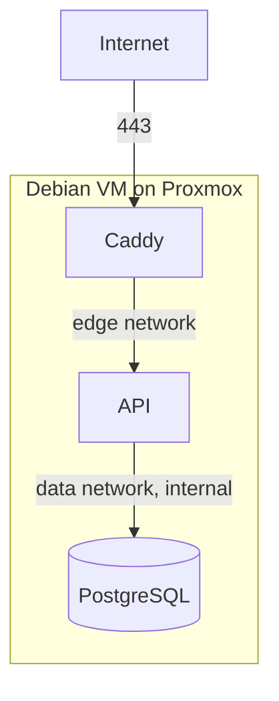

# Deployment

## The short version

On any host with Docker, in an empty directory:

```bash
curl -fsSLO https://raw.githubusercontent.com/DenislavMladenov/HairDresser_booking_platform/main/compose.yml
docker login ghcr.io                 # the images are private
docker compose up -d

docker compose exec api booking seed
docker compose exec -e ADMIN_EMAIL='you@example.com' -e ADMIN_PASSWORD='...' \
  api booking bootstrap-admin
```

That is the whole deployment. The app answers on port 80 at whatever address the
host has, whether that is `localhost`, `192.168.1.50` or a hostname. There is no
`.env` to write, no domain to declare and no origin to whitelist:

- the database password and the session secret are generated on first start and
  kept in a volume,
- migrations are applied by the API as it starts,
- the expected browser origin is derived from each request, so the same image
  works on every host,
- cookies are marked Secure only when the request actually arrived over HTTPS,
  because a browser would otherwise refuse to send them back.

Everything below is for the cases that need more: a public domain with HTTPS, a
VM built from scratch, backups, or publishing your own images.



## Going public with a domain

Two values, and only when you want a certificate:

```ini
DOMAIN=booking.example.com
ACME_EMAIL=you@example.com
```

Caddy then obtains and renews a certificate automatically, which requires public
DNS pointing at the machine and ports 80 and 443 reachable. Cookies become Secure
on their own, because the requests now arrive over HTTPS.

Full VM setup follows.

## 1. Create the VM

In Proxmox, a Debian 13 VM with 2 vCPU, 4 GB RAM, 50 GB disk. Give it a static
address or a DHCP reservation, since the DNS record will point at it.

Then, on the VM:

```bash
sudo apt update && sudo apt upgrade -y
sudo apt install -y ca-certificates curl git
```

Enable the QEMU guest agent in the VM options if you want clean Proxmox
shutdowns and snapshots.

## 2. Install Docker

```bash
sudo install -m 0755 -d /etc/apt/keyrings
sudo curl -fsSL https://download.docker.com/linux/debian/gpg -o /etc/apt/keyrings/docker.asc
sudo chmod a+r /etc/apt/keyrings/docker.asc
echo "deb [arch=$(dpkg --print-architecture) signed-by=/etc/apt/keyrings/docker.asc] https://download.docker.com/linux/debian $(. /etc/os-release && echo "$VERSION_CODENAME") stable" \
  | sudo tee /etc/apt/sources.list.d/docker.list > /dev/null
sudo apt update
sudo apt install -y docker-ce docker-ce-cli containerd.io docker-buildx-plugin docker-compose-plugin
sudo systemctl enable --now docker
sudo usermod -aG docker "$USER"
```

Log out and back in for the group change to apply, then check with `docker info`.

## Local network only, without a domain

Nothing to configure: this is the default. Skip steps 3 and 4 entirely and go to
step 5. The app answers on port 80 for the machine's IP, its hostname and
localhost alike, and login works from every one of them.

One consequence is worth stating plainly. Traffic is unencrypted, which is
usually fine on a trusted network but means anyone on it can read customer names
and phone numbers in transit. Cookies are correspondingly not marked Secure,
since a browser would refuse to send them back to an insecure origin.

If you want encryption without a public domain, add `tls internal` inside the site
block of the [Caddyfile](../docker/caddy/Caddyfile). Caddy then issues a
certificate from its own authority; browsers warn once per device unless you
install its root certificate.

## 3. DNS and firewall

Point an A record (and AAAA if you have IPv6) at the VM. Certificate issuance
fails without it, since Let's Encrypt validates over port 80.

Only 80 and 443 need to be reachable. If you use a firewall:

```bash
sudo apt install -y ufw
sudo ufw allow OpenSSH
sudo ufw allow 80/tcp
sudo ufw allow 443/tcp
sudo ufw enable
```

Docker publishes ports by manipulating nftables directly, which can bypass ufw
rules. The stack only publishes 80 and 443, which is what you want open anyway,
and PostgreSQL publishes nothing at all.

## 4. Configure, only if you need to

The server needs `compose.yml` and nothing else:

```bash
sudo mkdir -p /opt/booking && cd /opt/booking
sudo curl -fsSLO https://raw.githubusercontent.com/DenislavMladenov/HairDresser_booking_platform/main/compose.yml
```

Add a `.env` beside it only to change a default. The ones that matter:

| Variable            | When you need it                                           |
| ------------------- | ---------------------------------------------------------- |
| `DOMAIN`            | A public hostname, for automatic HTTPS. Defaults to `:80`. |
| `ACME_EMAIL`        | With a real `DOMAIN`, for certificate expiry warnings.     |
| `BUSINESS_TIMEZONE` | The shop is not in `Europe/Sofia`.                         |
| `HTTP_PORT`         | Something already uses port 80 on the host.                |
| `IMAGE_TAG`         | Pin a specific build instead of following `latest`.        |
| `SESSION_TTL_DAYS`  | Sessions should last longer or shorter than a week.        |

The database password and session secret are generated into the `secrets` volume
on first start, so there is nothing to write down. If you would rather supply
your own, set `POSTGRES_PASSWORD` and `SESSION_SECRET` before the first start and
they are used instead; changing them later does not reach an already initialised
database.

Because those credentials live in a volume rather than a file, include the
`secrets` volume in backups. A database restored next to a freshly generated
password will not open. See
[backup-and-restore.md](backup-and-restore.md).

## 5. Start the stack

[compose.yml](../compose.yml) deploys pre-built images, so the server compiles
nothing. Building needs 1 to 2 GB of RAM and is by far the heaviest thing that
would otherwise happen on the VM.

The images are private, so authenticate first. Use a GitHub personal access
token with only the `read:packages` scope, not one that can write:

```bash
echo "$GHCR_READ_TOKEN" | docker login ghcr.io -u DenislavMladenov --password-stdin

docker compose pull
docker compose up -d
docker compose ps
docker compose logs -f caddy   # watch the certificate being issued
```

The API applies pending migrations on start, so there is no separate migration
step. Publishing new images and running `docker compose pull && docker compose up -d`
is the whole deployment.

Building on the server instead is still supported, if you would rather not use a
registry. It needs the repository present and enough free memory:

```bash
docker compose -f compose.yml -f compose.build.yml up -d --build
```

If you want to rehearse certificate issuance without burning rate limits,
uncomment the `acme_ca` staging line in [docker/caddy/Caddyfile](../docker/caddy/Caddyfile)
first, then remove it and run `docker compose up -d --force-recreate caddy`.

## 6. Create the admin account and baseline data

```bash
# Baseline working hours and booking policy.
docker compose exec api booking seed

# The admin account. Use a long unique password from your password manager.
docker compose exec \
  -e ADMIN_EMAIL='you@example.com' \
  -e ADMIN_PASSWORD='...' \
  api booking bootstrap-admin
```

`booking` is a small wrapper in the image that resolves the generated credentials
before running the script, which `docker compose exec` would otherwise skip
because it bypasses the entrypoint. `booking migrate` is also available, though
the API already applies migrations as it starts.

The password is read from the environment and never from an argument, because
arguments are visible in the process list and in shell history. Prefix the
command with a space, or unset `HISTFILE`, if your shell records it.

Re-running the bootstrap is safe. To change the password later, add
`-e ADMIN_RESET_PASSWORD=true`; every active session is revoked.

Then sign in at `/admin/login` on whatever address the machine answers on, and set
the real services, opening hours and booking policy.

## 7. Verify

Replace the address with your domain, the machine's IP, or `localhost`.

```bash
curl -fsS http://localhost/api/health           # {"status":"ok","database":"up"}
curl -fsS http://localhost/api/services          # the catalogue
curl -fsS -o /dev/null -w '%{http_code}\n' \
  http://localhost/api/admin/bookings            # 401, as it should be
```

Also confirm PostgreSQL is not reachable from outside:

```bash
# From another machine. Both should fail to connect.
nc -zv <server> 5432
nc -zv <server> 3000
```

## Publishing new images

From your development machine, not the server. Log in with a token that has
`write:packages`, then:

```bash
./scripts/publish-images.sh            # tags with the current commit, plus latest
./scripts/publish-images.sh v1.1.0     # or an explicit version
```

The script refuses to run without credentials, warns if the working tree is
dirty, and prints the tag to pin on the server.

Pushing a `v*` git tag does the same thing through GitHub Actions, which is worth
preferring because it does not depend on one particular laptop. See
[.github/workflows/publish-images.yml](../.github/workflows/publish-images.yml).

## Updating

```bash
cd /opt/booking
docker compose pull
docker compose up -d
docker compose logs -f api
```

Note there is no `git pull` here: the server holds only `compose.yml` and `.env`,
and the code arrives inside the images.

Take a database backup first if the update includes migrations. Migrations here
are additive, but a snapshot costs nothing:

```bash
./scripts/backup-database.sh
```

## Rolling back

Because every push is also tagged with its commit, going back is a matter of
pinning the previous tag:

```bash
sed -i 's/^IMAGE_TAG=.*/IMAGE_TAG=1a2b3c4/' .env
docker compose pull
docker compose up -d
```

That covers application code. A migration is not rolled back by pinning an older
image, since the schema change has already been applied; restore from a backup if
a migration itself is the problem.

## Operating notes

Logs, on the host:

```bash
docker compose logs -f api
docker compose logs --since 1h caddy
```

Restart or stop:

```bash
docker compose restart api
docker compose down          # keeps the volumes, so no data is lost
```

Resource limits are set in [compose.yml](../compose.yml): 1 GB for PostgreSQL,
512 MB for the API, 256 MB for Caddy. That leaves room on a 4 GB VM. Raise the
PostgreSQL limit before anything else if the shop grows.

Proxmox snapshots are convenient but are not a substitute for database dumps: a
snapshot of a running VM can capture a torn database state. Use both, and see
[backup-and-restore.md](backup-and-restore.md).
