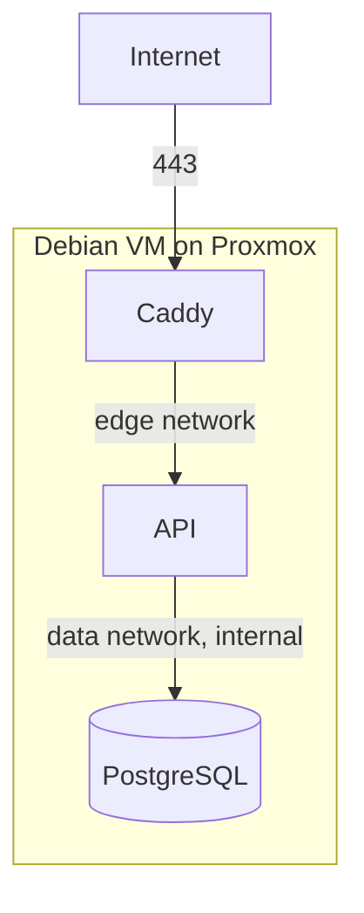

# Deployment

Target: a Debian VM on Proxmox VE, running Docker Compose. 2 vCPU, 4 GB RAM and
50 GB of disk is enough; the stack idles at a few hundred megabytes.



## 1. Create the VM

In Proxmox, a Debian 13 VM with 2 vCPU, 4 GB RAM, 50 GB disk. Give it a static
address or a DHCP reservation, since the DNS record will point at it.

Then, on the VM:

```bash
sudo apt update && sudo apt upgrade -y
sudo apt install -y ca-certificates curl git
```

Enable the QEMU guest agent in the VM options if you want clean Proxmox
shutdowns and snapshots.

## 2. Install Docker

```bash
sudo install -m 0755 -d /etc/apt/keyrings
sudo curl -fsSL https://download.docker.com/linux/debian/gpg -o /etc/apt/keyrings/docker.asc
sudo chmod a+r /etc/apt/keyrings/docker.asc
echo "deb [arch=$(dpkg --print-architecture) signed-by=/etc/apt/keyrings/docker.asc] https://download.docker.com/linux/debian $(. /etc/os-release && echo "$VERSION_CODENAME") stable" \
  | sudo tee /etc/apt/sources.list.d/docker.list > /dev/null
sudo apt update
sudo apt install -y docker-ce docker-ce-cli containerd.io docker-buildx-plugin docker-compose-plugin
sudo systemctl enable --now docker
sudo usermod -aG docker "$USER"
```

Log out and back in for the group change to apply, then check with `docker info`.

## Local network only, without a domain

If the shop's machine should serve the app on the local network rather than the
internet, skip DNS and certificates and set these three values in `.env`:

```ini
# Answer on port 80 for any hostname, so the IP, the machine name and localhost
# all work. No certificate is requested.
DOMAIN=:80

# Must match what the browser shows, because the API checks the request Origin.
APP_URL=http://192.168.1.50

# Any other address you also open the app from.
CORS_ORIGINS=http://localhost,http://barber.local
```

Then continue from step 5; steps 3 and 4 about DNS and certificates do not apply.

Two things behave differently over plain HTTP. Cookies are not marked Secure,
because a browser refuses to send Secure cookies to an insecure origin and the
session would be dropped right after signing in; the API logs a warning at start
so this is never silent. And traffic is unencrypted, which is acceptable on a
trusted local network but means anyone on that network can read the customer
details in transit.

Note that `http://localhost` is a special case: browsers treat it as trusted, so
a stack configured for HTTPS still works when opened on the machine itself. The
problem only appears from a second device, which is worth knowing before
concluding that login is broken.

If you later want encryption without a public domain, `tls internal` in the
[Caddyfile](../docker/caddy/Caddyfile) issues a certificate from Caddy's own
authority. Browsers warn once per device unless you install its root certificate.

## 3. DNS and firewall

Point an A record (and AAAA if you have IPv6) at the VM. Certificate issuance
fails without it, since Let's Encrypt validates over port 80.

Only 80 and 443 need to be reachable. If you use a firewall:

```bash
sudo apt install -y ufw
sudo ufw allow OpenSSH
sudo ufw allow 80/tcp
sudo ufw allow 443/tcp
sudo ufw enable
```

Docker publishes ports by manipulating nftables directly, which can bypass ufw
rules. The stack only publishes 80 and 443, which is what you want open anyway,
and PostgreSQL publishes nothing at all.

## 4. Get the code and configure it

```bash
git clone <your-repository-url> /opt/booking
cd /opt/booking
cp .env.example .env
chmod 600 .env
```

Generate the secrets on the VM and put them in `.env`:

```bash
openssl rand -base64 36   # SESSION_SECRET
openssl rand -base64 18   # POSTGRES_PASSWORD
```

The values that matter in production:

| Variable            | Value                                                    |
| ------------------- | -------------------------------------------------------- |
| `DOMAIN`            | `booking.example.com`, the site address Caddy serves     |
| `ACME_EMAIL`        | your address, for certificate expiry warnings            |
| `APP_URL`           | `https://booking.example.com`, used for cookies and CORS |
| `CORS_ORIGINS`      | usually empty; `APP_URL` is always allowed               |
| `POSTGRES_PASSWORD` | generated above                                          |
| `SESSION_SECRET`    | generated above, at least 32 characters                  |
| `BUSINESS_TIMEZONE` | `Europe/Sofia`                                           |
| `ENABLE_SWAGGER`    | `false`                                                  |
| `IMAGE_REGISTRY`    | `ghcr.io/denislavmladenov`                               |
| `IMAGE_TAG`         | `latest`, or a commit tag to pin the deploy              |

`.env` is not committed and must never be. Keep a copy in your password manager;
losing `POSTGRES_PASSWORD` means losing access to the data, and rotating
`SESSION_SECRET` signs everyone out.

## 5. Start the stack

[compose.yml](../compose.yml) deploys pre-built images, so the server compiles
nothing. Building needs 1 to 2 GB of RAM and is by far the heaviest thing that
would otherwise happen on the VM.

The images are private, so authenticate first. Use a GitHub personal access
token with only the `read:packages` scope, not one that can write:

```bash
echo "$GHCR_READ_TOKEN" | docker login ghcr.io -u DenislavMladenov --password-stdin

docker compose pull
docker compose up -d
docker compose ps
docker compose logs -f caddy   # watch the certificate being issued
```

The API applies pending migrations on start, so there is no separate migration
step. Publishing new images and running `docker compose pull && docker compose up -d`
is the whole deployment.

Building on the server instead is still supported, if you would rather not use a
registry. It needs the repository present and enough free memory:

```bash
docker compose -f compose.yml -f compose.build.yml up -d --build
```

If you want to rehearse certificate issuance without burning rate limits,
uncomment the `acme_ca` staging line in [docker/caddy/Caddyfile](../docker/caddy/Caddyfile)
first, then remove it and run `docker compose up -d --force-recreate caddy`.

## 6. Create the admin account and baseline data

```bash
# Baseline working hours and booking policy.
docker compose exec api node dist/scripts/seed.js

# The admin account. Use a long unique password from your password manager.
docker compose exec \
  -e ADMIN_EMAIL='you@example.com' \
  -e ADMIN_PASSWORD='...' \
  api node dist/scripts/bootstrap-admin.js
```

The password is read from the environment and never from an argument, because
arguments are visible in the process list and in shell history. Prefix the
command with a space, or unset `HISTFILE`, if your shell records it.

Re-running the bootstrap is safe. To change the password later, add
`-e ADMIN_RESET_PASSWORD=true`; every active session is revoked.

Then sign in at `https://booking.example.com/admin/login` and set the real
services, opening hours and booking policy.

## 7. Verify

```bash
curl -fsS https://booking.example.com/api/health          # {"status":"ok","database":"up"}
curl -fsS https://booking.example.com/api/services         # the catalogue
curl -fsS -o /dev/null -w '%{http_code}\n' \
  https://booking.example.com/api/admin/bookings           # 401, as it should be
```

Also confirm PostgreSQL is not reachable from outside:

```bash
# From another machine. Both should fail to connect.
nc -zv booking.example.com 5432
nc -zv booking.example.com 3000
```

## Publishing new images

From your development machine, not the server. Log in with a token that has
`write:packages`, then:

```bash
./scripts/publish-images.sh            # tags with the current commit, plus latest
./scripts/publish-images.sh v1.1.0     # or an explicit version
```

The script refuses to run without credentials, warns if the working tree is
dirty, and prints the tag to pin on the server.

Pushing a `v*` git tag does the same thing through GitHub Actions, which is worth
preferring because it does not depend on one particular laptop. See
[.github/workflows/publish-images.yml](../.github/workflows/publish-images.yml).

## Updating

```bash
cd /opt/booking
docker compose pull
docker compose up -d
docker compose logs -f api
```

Note there is no `git pull` here: the server holds only `compose.yml` and `.env`,
and the code arrives inside the images.

Take a database backup first if the update includes migrations. Migrations here
are additive, but a snapshot costs nothing:

```bash
./scripts/backup-database.sh
```

## Rolling back

Because every push is also tagged with its commit, going back is a matter of
pinning the previous tag:

```bash
sed -i 's/^IMAGE_TAG=.*/IMAGE_TAG=1a2b3c4/' .env
docker compose pull
docker compose up -d
```

That covers application code. A migration is not rolled back by pinning an older
image, since the schema change has already been applied; restore from a backup if
a migration itself is the problem.

## Operating notes

Logs, on the host:

```bash
docker compose logs -f api
docker compose logs --since 1h caddy
```

Restart or stop:

```bash
docker compose restart api
docker compose down          # keeps the volumes, so no data is lost
```

Resource limits are set in [compose.yml](../compose.yml): 1 GB for PostgreSQL,
512 MB for the API, 256 MB for Caddy. That leaves room on a 4 GB VM. Raise the
PostgreSQL limit before anything else if the shop grows.

Proxmox snapshots are convenient but are not a substitute for database dumps: a
snapshot of a running VM can capture a torn database state. Use both, and see
[backup-and-restore.md](backup-and-restore.md).
