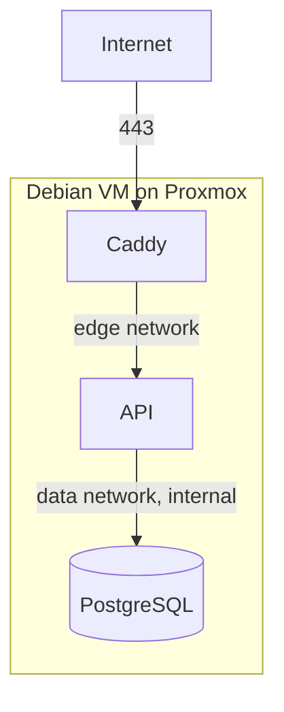

# Deployment

Target: a Debian VM on Proxmox VE, running Docker Compose. 2 vCPU, 4 GB RAM and
50 GB of disk is enough; the stack idles at a few hundred megabytes.



## 1. Create the VM

In Proxmox, a Debian 13 VM with 2 vCPU, 4 GB RAM, 50 GB disk. Give it a static
address or a DHCP reservation, since the DNS record will point at it.

Then, on the VM:

```bash
sudo apt update && sudo apt upgrade -y
sudo apt install -y ca-certificates curl git
```

Enable the QEMU guest agent in the VM options if you want clean Proxmox
shutdowns and snapshots.

## 2. Install Docker

```bash
sudo install -m 0755 -d /etc/apt/keyrings
sudo curl -fsSL https://download.docker.com/linux/debian/gpg -o /etc/apt/keyrings/docker.asc
sudo chmod a+r /etc/apt/keyrings/docker.asc
echo "deb [arch=$(dpkg --print-architecture) signed-by=/etc/apt/keyrings/docker.asc] https://download.docker.com/linux/debian $(. /etc/os-release && echo "$VERSION_CODENAME") stable" \
  | sudo tee /etc/apt/sources.list.d/docker.list > /dev/null
sudo apt update
sudo apt install -y docker-ce docker-ce-cli containerd.io docker-buildx-plugin docker-compose-plugin
sudo systemctl enable --now docker
sudo usermod -aG docker "$USER"
```

Log out and back in for the group change to apply, then check with `docker info`.

## 3. DNS and firewall

Point an A record (and AAAA if you have IPv6) at the VM. Certificate issuance
fails without it, since Let's Encrypt validates over port 80.

Only 80 and 443 need to be reachable. If you use a firewall:

```bash
sudo apt install -y ufw
sudo ufw allow OpenSSH
sudo ufw allow 80/tcp
sudo ufw allow 443/tcp
sudo ufw enable
```

Docker publishes ports by manipulating nftables directly, which can bypass ufw
rules. The stack only publishes 80 and 443, which is what you want open anyway,
and PostgreSQL publishes nothing at all.

## 4. Get the code and configure it

```bash
git clone <your-repository-url> /opt/booking
cd /opt/booking
cp .env.example .env
chmod 600 .env
```

Generate the secrets on the VM and put them in `.env`:

```bash
openssl rand -base64 36   # SESSION_SECRET
openssl rand -base64 18   # POSTGRES_PASSWORD
```

The values that matter in production:

| Variable            | Value                                                            |
| ------------------- | ---------------------------------------------------------------- |
| `DOMAIN`            | `booking.example.com`, the site address Caddy serves             |
| `ACME_EMAIL`        | your address, for certificate expiry warnings                    |
| `APP_URL`           | `https://booking.example.com`, used for cookies and CORS         |
| `CORS_ORIGINS`      | usually empty; `APP_URL` is always allowed                       |
| `POSTGRES_PASSWORD` | generated above                                                  |
| `SESSION_SECRET`    | generated above, at least 32 characters                          |
| `BUSINESS_TIMEZONE` | `Europe/Sofia`                                                   |
| `ENABLE_SWAGGER`    | `false`                                                          |

`.env` is not committed and must never be. Keep a copy in your password manager;
losing `POSTGRES_PASSWORD` means losing access to the data, and rotating
`SESSION_SECRET` signs everyone out.

## 5. Start the stack

```bash
docker compose up -d --build
docker compose ps
docker compose logs -f caddy   # watch the certificate being issued
```

The API applies pending migrations on start, so there is no separate migration
step. `docker compose up -d` after a code change is the whole deployment.

If you want to rehearse certificate issuance without burning rate limits,
uncomment the `acme_ca` staging line in [docker/caddy/Caddyfile](../docker/caddy/Caddyfile)
first, then remove it and run `docker compose up -d --force-recreate caddy`.

## 6. Create the admin account and baseline data

```bash
# Baseline working hours and booking policy.
docker compose exec api node dist/scripts/seed.js

# The admin account. Use a long unique password from your password manager.
docker compose exec \
  -e ADMIN_EMAIL='you@example.com' \
  -e ADMIN_PASSWORD='...' \
  api node dist/scripts/bootstrap-admin.js
```

The password is read from the environment and never from an argument, because
arguments are visible in the process list and in shell history. Prefix the
command with a space, or unset `HISTFILE`, if your shell records it.

Re-running the bootstrap is safe. To change the password later, add
`-e ADMIN_RESET_PASSWORD=true`; every active session is revoked.

Then sign in at `https://booking.example.com/admin/login` and set the real
services, opening hours and booking policy.

## 7. Verify

```bash
curl -fsS https://booking.example.com/api/health          # {"status":"ok","database":"up"}
curl -fsS https://booking.example.com/api/services         # the catalogue
curl -fsS -o /dev/null -w '%{http_code}\n' \
  https://booking.example.com/api/admin/bookings           # 401, as it should be
```

Also confirm PostgreSQL is not reachable from outside:

```bash
# From another machine. Both should fail to connect.
nc -zv booking.example.com 5432
nc -zv booking.example.com 3000
```

## Updating

```bash
cd /opt/booking
git pull
docker compose up -d --build
docker compose logs -f api
```

Take a database backup first if the update includes migrations. Migrations here
are additive, but a snapshot costs nothing:

```bash
./scripts/backup-database.sh
```

To roll back application code, check out the previous commit and rebuild.
Rolling back a migration is not automatic; restore from a backup instead.

## Operating notes

Logs, on the host:

```bash
docker compose logs -f api
docker compose logs --since 1h caddy
```

Restart or stop:

```bash
docker compose restart api
docker compose down          # keeps the volumes, so no data is lost
```

Resource limits are set in [compose.yml](../compose.yml): 1 GB for PostgreSQL,
512 MB for the API, 256 MB for Caddy. That leaves room on a 4 GB VM. Raise the
PostgreSQL limit before anything else if the shop grows.

Proxmox snapshots are convenient but are not a substitute for database dumps: a
snapshot of a running VM can capture a torn database state. Use both, and see
[backup-and-restore.md](backup-and-restore.md).
